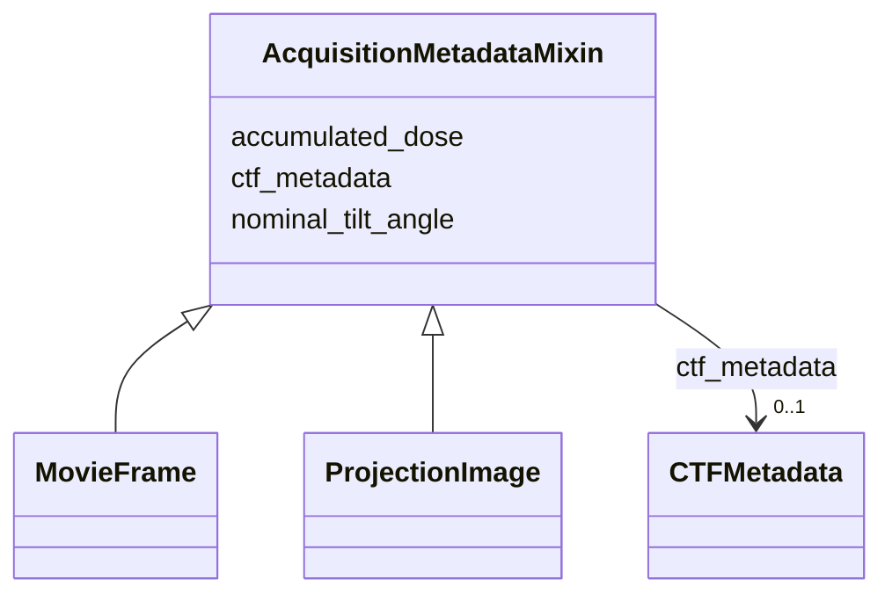

# Class: AcquisitionMetadataMixin


_Metadata concerning the acquisition process._


URI: [https://w3id.org/cetmd/entities/:AcquisitionMetadataMixin](https://w3id.org/cetmd/entities/:AcquisitionMetadataMixin)





<!-- no inheritance hierarchy -->


## Slots

| Name | Cardinality and Range | Description | Inheritance |
| ---  | --- | --- | --- |
| [nominal_tilt_angle](nominal_tilt_angle.md) | 0..1 <br/> [Float](Float.md) | The tilt angle reported by the microscope | direct |
| [accumulated_dose](accumulated_dose.md) | 0..1 <br/> [Float](Float.md) | The pre-exposure up to this image in e-/A^2 | direct |
| [ctf_metadata](ctf_metadata.md) | 0..1 <br/> [CTFMetadata](CTFMetadata.md) | A set of CTF patameters for an image | direct |


## Identifier and Mapping Information


### Schema Source


* from schema: https://w3id.org/cetmd/entities


## Mappings

| Mapping Type | Mapped Value |
| ---  | ---  |
| self | https://w3id.org/cetmd/entities/:AcquisitionMetadataMixin |
| native | https://w3id.org/cetmd/entities/:AcquisitionMetadataMixin |


## LinkML Source

<!-- TODO: investigate https://stackoverflow.com/questions/37606292/how-to-create-tabbed-code-blocks-in-mkdocs-or-sphinx -->

### Direct

<details>
```yaml
name: AcquisitionMetadataMixin
description: Metadata concerning the acquisition process.
from_schema: https://w3id.org/cetmd/entities
slots:
- nominal_tilt_angle
- accumulated_dose
- ctf_metadata

```
</details>

### Induced

<details>
```yaml
name: AcquisitionMetadataMixin
description: Metadata concerning the acquisition process.
from_schema: https://w3id.org/cetmd/entities
attributes:
  nominal_tilt_angle:
    name: nominal_tilt_angle
    description: The tilt angle reported by the microscope
    from_schema: https://w3id.org/cetmd/entities
    rank: 1000
    alias: nominal_tilt_angle
    owner: AcquisitionMetadataMixin
    domain_of:
    - AcquisitionMetadataMixin
    range: float
  accumulated_dose:
    name: accumulated_dose
    description: The pre-exposure up to this image in e-/A^2
    from_schema: https://w3id.org/cetmd/entities
    rank: 1000
    alias: accumulated_dose
    owner: AcquisitionMetadataMixin
    domain_of:
    - AcquisitionMetadataMixin
    range: float
  ctf_metadata:
    name: ctf_metadata
    description: A set of CTF patameters for an image.
    from_schema: https://w3id.org/cetmd/entities
    rank: 1000
    alias: ctf_metadata
    owner: AcquisitionMetadataMixin
    domain_of:
    - AcquisitionMetadataMixin
    range: CTFMetadata

```
</details>