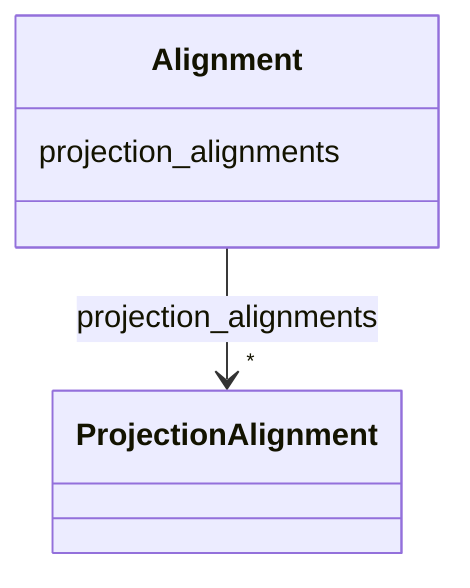

# Class: Alignment


_The tomographic alignment for a tilt series._


URI: [https://w3id.org/cetmd/entities/:Alignment](https://w3id.org/cetmd/entities/:Alignment)





<!-- no inheritance hierarchy -->


## Slots

| Name | Cardinality and Range | Description | Inheritance |
| ---  | --- | --- | --- |
| [projection_alignments](projection_alignments.md) | * <br/> [ProjectionAlignment](ProjectionAlignment.md) | alignment for a specific projection | direct |


## Usages

| used by | used in | type | used |
| ---  | --- | --- | --- |
| [Region](Region.md) | [alignments](alignments.md) | range | [Alignment](Alignment.md) |


## Identifier and Mapping Information


### Schema Source


* from schema: https://w3id.org/cetmd/entities


## Mappings

| Mapping Type | Mapped Value |
| ---  | ---  |
| self | https://w3id.org/cetmd/entities/:Alignment |
| native | https://w3id.org/cetmd/entities/:Alignment |


## LinkML Source

<!-- TODO: investigate https://stackoverflow.com/questions/37606292/how-to-create-tabbed-code-blocks-in-mkdocs-or-sphinx -->

### Direct

<details>
```yaml
name: Alignment
description: The tomographic alignment for a tilt series.
from_schema: https://w3id.org/cetmd/entities
attributes:
  projection_alignments:
    name: projection_alignments
    description: alignment for a specific projection
    from_schema: https://w3id.org/cetmd/alignment/
    rank: 1000
    domain_of:
    - Alignment
    range: ProjectionAlignment
    multivalued: true

```
</details>

### Induced

<details>
```yaml
name: Alignment
description: The tomographic alignment for a tilt series.
from_schema: https://w3id.org/cetmd/entities
attributes:
  projection_alignments:
    name: projection_alignments
    description: alignment for a specific projection
    from_schema: https://w3id.org/cetmd/alignment/
    rank: 1000
    alias: projection_alignments
    owner: Alignment
    domain_of:
    - Alignment
    range: ProjectionAlignment
    multivalued: true

```
</details>