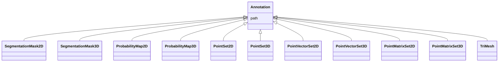

# Class: Annotation


_A primitive annotation._


URI: [https://w3id.org/cetmd/entities/:Annotation](https://w3id.org/cetmd/entities/:Annotation)





## Inheritance
* **Annotation**
    * [SegmentationMask2D](SegmentationMask2D.md) [ [Image2D](Image2D.md)]
    * [SegmentationMask3D](SegmentationMask3D.md) [ [Image3D](Image3D.md)]
    * [ProbabilityMap2D](ProbabilityMap2D.md) [ [Image2D](Image2D.md)]
    * [ProbabilityMap3D](ProbabilityMap3D.md) [ [Image3D](Image3D.md)]
    * [PointSet2D](PointSet2D.md) [ [CoordMetaMixin](CoordMetaMixin.md)]
    * [PointSet3D](PointSet3D.md) [ [CoordMetaMixin](CoordMetaMixin.md)]
    * [PointVectorSet2D](PointVectorSet2D.md) [ [CoordMetaMixin](CoordMetaMixin.md)]
    * [PointVectorSet3D](PointVectorSet3D.md) [ [CoordMetaMixin](CoordMetaMixin.md)]
    * [PointMatrixSet2D](PointMatrixSet2D.md) [ [CoordMetaMixin](CoordMetaMixin.md)]
    * [PointMatrixSet3D](PointMatrixSet3D.md) [ [CoordMetaMixin](CoordMetaMixin.md)]
    * [TriMesh](TriMesh.md) [ [CoordMetaMixin](CoordMetaMixin.md)]


## Slots

| Name | Cardinality and Range | Description | Inheritance |
| ---  | --- | --- | --- |
| [path](path.md) | 0..1 <br/> [String](String.md) | Path to a file | direct |


## Usages

| used by | used in | type | used |
| ---  | --- | --- | --- |
| [Region](Region.md) | [annotations](annotations.md) | range | [Annotation](Annotation.md) |
| [Average](Average.md) | [annotations](annotations.md) | range | [Annotation](Annotation.md) |


## Identifier and Mapping Information


### Schema Source


* from schema: https://w3id.org/cetmd/entities


## Mappings

| Mapping Type | Mapped Value |
| ---  | ---  |
| self | https://w3id.org/cetmd/entities/:Annotation |
| native | https://w3id.org/cetmd/entities/:Annotation |


## LinkML Source

<!-- TODO: investigate https://stackoverflow.com/questions/37606292/how-to-create-tabbed-code-blocks-in-mkdocs-or-sphinx -->

### Direct

<details>
```yaml
name: Annotation
description: A primitive annotation.
from_schema: https://w3id.org/cetmd/entities
slots:
- path

```
</details>

### Induced

<details>
```yaml
name: Annotation
description: A primitive annotation.
from_schema: https://w3id.org/cetmd/entities
attributes:
  path:
    name: path
    description: Path to a file.
    from_schema: https://w3id.org/cetmd/entities
    rank: 1000
    alias: path
    owner: Annotation
    domain_of:
    - GainFile
    - DefectFile
    - MovieFrame
    - MovieStack
    - ProjectionImage
    - TiltSeries
    - Tomogram
    - ParticleMap
    - Annotation
    range: string

```
</details>