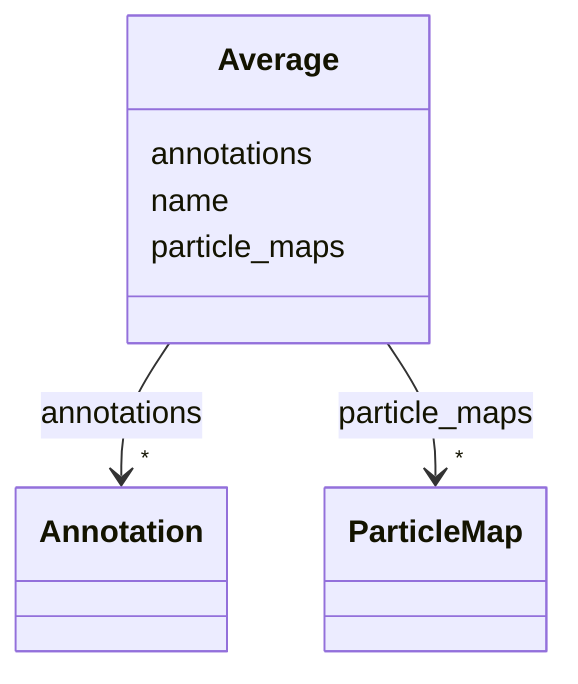

# Class: Average


_A particle averaging experiment._


URI: [https://w3id.org/cetmd/entities/:Average](https://w3id.org/cetmd/entities/:Average)





<!-- no inheritance hierarchy -->


## Slots

| Name | Cardinality and Range | Description | Inheritance |
| ---  | --- | --- | --- |
| [name](name.md) | 0..1 <br/> [String](String.md) | The name of a given entry | direct |
| [annotations](annotations.md) | * <br/> [Annotation](Annotation.md) | The annotations | direct |
| [particle_maps](particle_maps.md) | * <br/> [ParticleMap](ParticleMap.md) | The particle maps | direct |


## Usages

| used by | used in | type | used |
| ---  | --- | --- | --- |
| [Dataset](Dataset.md) | [averages](averages.md) | range | [Average](Average.md) |


## Identifier and Mapping Information


### Schema Source


* from schema: https://w3id.org/cetmd/entities


## Mappings

| Mapping Type | Mapped Value |
| ---  | ---  |
| self | https://w3id.org/cetmd/entities/:Average |
| native | https://w3id.org/cetmd/entities/:Average |


## LinkML Source

<!-- TODO: investigate https://stackoverflow.com/questions/37606292/how-to-create-tabbed-code-blocks-in-mkdocs-or-sphinx -->

### Direct

<details>
```yaml
name: Average
description: A particle averaging experiment.
from_schema: https://w3id.org/cetmd/entities
slots:
- name
- annotations
attributes:
  particle_maps:
    name: particle_maps
    description: The particle maps
    from_schema: https://w3id.org/cetmd/entities
    rank: 1000
    domain_of:
    - Average
    range: ParticleMap
    multivalued: true

```
</details>

### Induced

<details>
```yaml
name: Average
description: A particle averaging experiment.
from_schema: https://w3id.org/cetmd/entities
attributes:
  particle_maps:
    name: particle_maps
    description: The particle maps
    from_schema: https://w3id.org/cetmd/entities
    rank: 1000
    alias: particle_maps
    owner: Average
    domain_of:
    - Average
    range: ParticleMap
    multivalued: true
  name:
    name: name
    description: The name of a given entry
    from_schema: https://w3id.org/cetmd/entities
    rank: 1000
    alias: name
    owner: Average
    domain_of:
    - Average
    - Dataset
    - CoordinateSystem
    - CoordinateTransformation
    range: string
  annotations:
    name: annotations
    description: The annotations
    from_schema: https://w3id.org/cetmd/entities
    rank: 1000
    alias: annotations
    owner: Average
    domain_of:
    - Region
    - Average
    range: Annotation
    multivalued: true

```
</details>