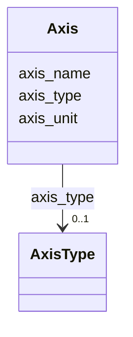

# Class: Axis


_An axis in a coordinate system_


URI: [https://w3id.org/cetmd/entities/:Axis](https://w3id.org/cetmd/entities/:Axis)





<!-- no inheritance hierarchy -->


## Slots

| Name | Cardinality and Range | Description | Inheritance |
| ---  | --- | --- | --- |
| [axis_name](axis_name.md) | 0..1 <br/> [String](String.md) | The name of the axis | direct |
| [axis_unit](axis_unit.md) | 0..1 <br/> [String](String.md) | The unit of the axis | direct |
| [axis_type](axis_type.md) | 0..1 <br/> [AxisType](AxisType.md) | The type of axis | direct |


## Usages

| used by | used in | type | used |
| ---  | --- | --- | --- |
| [CoordinateSystem](CoordinateSystem.md) | [axes](axes.md) | range | [Axis](Axis.md) |


## Identifier and Mapping Information


### Schema Source


* from schema: https://w3id.org/cetmd/entities


## Mappings

| Mapping Type | Mapped Value |
| ---  | ---  |
| self | https://w3id.org/cetmd/entities/:Axis |
| native | https://w3id.org/cetmd/entities/:Axis |


## LinkML Source

<!-- TODO: investigate https://stackoverflow.com/questions/37606292/how-to-create-tabbed-code-blocks-in-mkdocs-or-sphinx -->

### Direct

<details>
```yaml
name: Axis
description: An axis in a coordinate system
from_schema: https://w3id.org/cetmd/entities
slots:
- axis_name
- axis_unit
- axis_type

```
</details>

### Induced

<details>
```yaml
name: Axis
description: An axis in a coordinate system
from_schema: https://w3id.org/cetmd/entities
attributes:
  axis_name:
    name: axis_name
    description: The name of the axis
    from_schema: https://w3id.org/cetmd/entities
    rank: 1000
    alias: axis_name
    owner: Axis
    domain_of:
    - Axis
    range: string
  axis_unit:
    name: axis_unit
    description: The unit of the axis
    from_schema: https://w3id.org/cetmd/entities
    rank: 1000
    ifabsent: angstrom
    alias: axis_unit
    owner: Axis
    domain_of:
    - Axis
    range: string
  axis_type:
    name: axis_type
    description: The type of axis
    from_schema: https://w3id.org/cetmd/entities
    rank: 1000
    alias: axis_type
    owner: Axis
    domain_of:
    - Axis
    range: AxisType

```
</details>