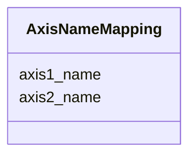

# Class: AxisNameMapping


_Axis name to Axis name mapping_


URI: [https://w3id.org/cetmd/entities/:AxisNameMapping](https://w3id.org/cetmd/entities/:AxisNameMapping)





<!-- no inheritance hierarchy -->


## Slots

| Name | Cardinality and Range | Description | Inheritance |
| ---  | --- | --- | --- |
| [axis1_name](axis1_name.md) | 0..1 <br/> [String](String.md) | The type of transformation | direct |
| [axis2_name](axis2_name.md) | 0..1 <br/> [String](String.md) | The mapping of the axis names | direct |


## Usages

| used by | used in | type | used |
| ---  | --- | --- | --- |
| [MapAxis](MapAxis.md) | [map_axis](map_axis.md) | range | [AxisNameMapping](AxisNameMapping.md) |


## Identifier and Mapping Information


### Schema Source


* from schema: https://w3id.org/cetmd/entities


## Mappings

| Mapping Type | Mapped Value |
| ---  | ---  |
| self | https://w3id.org/cetmd/entities/:AxisNameMapping |
| native | https://w3id.org/cetmd/entities/:AxisNameMapping |


## LinkML Source

<!-- TODO: investigate https://stackoverflow.com/questions/37606292/how-to-create-tabbed-code-blocks-in-mkdocs-or-sphinx -->

### Direct

<details>
```yaml
name: AxisNameMapping
description: Axis name to Axis name mapping
from_schema: https://w3id.org/cetmd/entities
attributes:
  axis1_name:
    name: axis1_name
    description: The type of transformation
    from_schema: https://w3id.org/cetmd/coord_transforms
    rank: 1000
    domain_of:
    - AxisNameMapping
    range: string
  axis2_name:
    name: axis2_name
    description: The mapping of the axis names
    from_schema: https://w3id.org/cetmd/coord_transforms
    rank: 1000
    domain_of:
    - AxisNameMapping
    range: string

```
</details>

### Induced

<details>
```yaml
name: AxisNameMapping
description: Axis name to Axis name mapping
from_schema: https://w3id.org/cetmd/entities
attributes:
  axis1_name:
    name: axis1_name
    description: The type of transformation
    from_schema: https://w3id.org/cetmd/coord_transforms
    rank: 1000
    alias: axis1_name
    owner: AxisNameMapping
    domain_of:
    - AxisNameMapping
    range: string
  axis2_name:
    name: axis2_name
    description: The mapping of the axis names
    from_schema: https://w3id.org/cetmd/coord_transforms
    rank: 1000
    alias: axis2_name
    owner: AxisNameMapping
    domain_of:
    - AxisNameMapping
    range: string

```
</details>