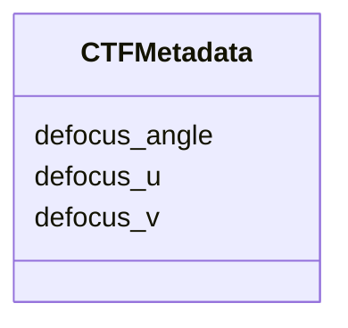

# Class: CTFMetadata


_A set of CTF patameters for an image._


URI: [https://w3id.org/cetmd/entities/:CTFMetadata](https://w3id.org/cetmd/entities/:CTFMetadata)





<!-- no inheritance hierarchy -->


## Slots

| Name | Cardinality and Range | Description | Inheritance |
| ---  | --- | --- | --- |
| [defocus_u](defocus_u.md) | 0..1 <br/> [Float](Float.md) | Estimated defocus U for this image in Angstrom, underfocus positive | direct |
| [defocus_v](defocus_v.md) | 0..1 <br/> [Float](Float.md) | Estimated defocus V for this image in Angstrom, underfocus positive | direct |
| [defocus_angle](defocus_angle.md) | 0..1 <br/> [Float](Float.md) | Estimated angle of astigmatism | direct |


## Usages

| used by | used in | type | used |
| ---  | --- | --- | --- |
| [AcquisitionMetadataMixin](AcquisitionMetadataMixin.md) | [ctf_metadata](ctf_metadata.md) | range | [CTFMetadata](CTFMetadata.md) |
| [MovieFrame](MovieFrame.md) | [ctf_metadata](ctf_metadata.md) | range | [CTFMetadata](CTFMetadata.md) |
| [ProjectionImage](ProjectionImage.md) | [ctf_metadata](ctf_metadata.md) | range | [CTFMetadata](CTFMetadata.md) |
| [SubProjectionImage](SubProjectionImage.md) | [ctf_metadata](ctf_metadata.md) | range | [CTFMetadata](CTFMetadata.md) |


## Identifier and Mapping Information


### Schema Source


* from schema: https://w3id.org/cetmd/entities


## Mappings

| Mapping Type | Mapped Value |
| ---  | ---  |
| self | https://w3id.org/cetmd/entities/:CTFMetadata |
| native | https://w3id.org/cetmd/entities/:CTFMetadata |


## LinkML Source

<!-- TODO: investigate https://stackoverflow.com/questions/37606292/how-to-create-tabbed-code-blocks-in-mkdocs-or-sphinx -->

### Direct

<details>
```yaml
name: CTFMetadata
description: A set of CTF patameters for an image.
from_schema: https://w3id.org/cetmd/entities
slots:
- defocus_u
- defocus_v
- defocus_angle

```
</details>

### Induced

<details>
```yaml
name: CTFMetadata
description: A set of CTF patameters for an image.
from_schema: https://w3id.org/cetmd/entities
attributes:
  defocus_u:
    name: defocus_u
    description: Estimated defocus U for this image in Angstrom, underfocus positive.
    from_schema: https://w3id.org/cetmd/entities
    rank: 1000
    alias: defocus_u
    owner: CTFMetadata
    domain_of:
    - CTFMetadata
    range: float
  defocus_v:
    name: defocus_v
    description: Estimated defocus V for this image in Angstrom, underfocus positive.
    from_schema: https://w3id.org/cetmd/entities
    rank: 1000
    alias: defocus_v
    owner: CTFMetadata
    domain_of:
    - CTFMetadata
    range: float
  defocus_angle:
    name: defocus_angle
    description: Estimated angle of astigmatism.
    from_schema: https://w3id.org/cetmd/entities
    rank: 1000
    alias: defocus_angle
    owner: CTFMetadata
    domain_of:
    - CTFMetadata
    range: float

```
</details>