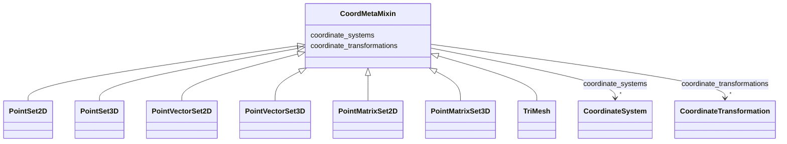

# Class: CoordMetaMixin


_Coordinate system mixins for annotations._


URI: [https://w3id.org/cetmd/entities/:CoordMetaMixin](https://w3id.org/cetmd/entities/:CoordMetaMixin)





<!-- no inheritance hierarchy -->


## Slots

| Name | Cardinality and Range | Description | Inheritance |
| ---  | --- | --- | --- |
| [coordinate_systems](coordinate_systems.md) | * <br/> [CoordinateSystem](CoordinateSystem.md) | Named coordinate systems for this entity | direct |
| [coordinate_transformations](coordinate_transformations.md) | * <br/> [CoordinateTransformation](CoordinateTransformation.md) | Named coordinate systems for this entity | direct |


## Identifier and Mapping Information


### Schema Source


* from schema: https://w3id.org/cetmd/entities


## Mappings

| Mapping Type | Mapped Value |
| ---  | ---  |
| self | https://w3id.org/cetmd/entities/:CoordMetaMixin |
| native | https://w3id.org/cetmd/entities/:CoordMetaMixin |


## LinkML Source

<!-- TODO: investigate https://stackoverflow.com/questions/37606292/how-to-create-tabbed-code-blocks-in-mkdocs-or-sphinx -->

### Direct

<details>
```yaml
name: CoordMetaMixin
description: Coordinate system mixins for annotations.
from_schema: https://w3id.org/cetmd/entities
slots:
- coordinate_systems
- coordinate_transformations

```
</details>

### Induced

<details>
```yaml
name: CoordMetaMixin
description: Coordinate system mixins for annotations.
from_schema: https://w3id.org/cetmd/entities
attributes:
  coordinate_systems:
    name: coordinate_systems
    description: Named coordinate systems for this entity
    from_schema: https://w3id.org/cetmd/entities
    rank: 1000
    alias: coordinate_systems
    owner: CoordMetaMixin
    domain_of:
    - Image2D
    - Image3D
    - CoordMetaMixin
    range: CoordinateSystem
    multivalued: true
  coordinate_transformations:
    name: coordinate_transformations
    description: Named coordinate systems for this entity
    from_schema: https://w3id.org/cetmd/entities
    rank: 1000
    alias: coordinate_transformations
    owner: CoordMetaMixin
    domain_of:
    - Image2D
    - Image3D
    - CoordMetaMixin
    range: CoordinateTransformation
    multivalued: true

```
</details>