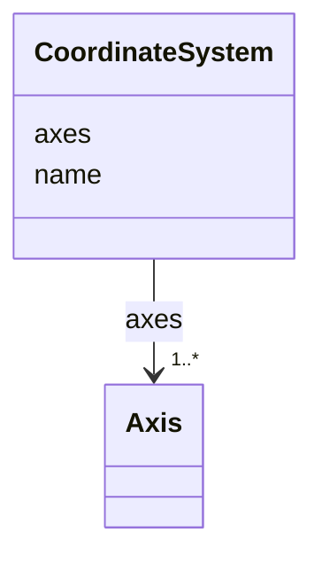

# Class: CoordinateSystem


_A coordinate system_


URI: [https://w3id.org/cetmd/entities/:CoordinateSystem](https://w3id.org/cetmd/entities/:CoordinateSystem)





<!-- no inheritance hierarchy -->


## Slots

| Name | Cardinality and Range | Description | Inheritance |
| ---  | --- | --- | --- |
| [name](name.md) | 1 <br/> [String](String.md) | The name of the coordinate system | direct |
| [axes](axes.md) | 1..* <br/> [Axis](Axis.md) | The axes of the coordinate system | direct |


## Usages

| used by | used in | type | used |
| ---  | --- | --- | --- |
| [Image2D](Image2D.md) | [coordinate_systems](coordinate_systems.md) | range | [CoordinateSystem](CoordinateSystem.md) |
| [Image3D](Image3D.md) | [coordinate_systems](coordinate_systems.md) | range | [CoordinateSystem](CoordinateSystem.md) |
| [GainFile](GainFile.md) | [coordinate_systems](coordinate_systems.md) | range | [CoordinateSystem](CoordinateSystem.md) |
| [DefectFile](DefectFile.md) | [coordinate_systems](coordinate_systems.md) | range | [CoordinateSystem](CoordinateSystem.md) |
| [MovieFrame](MovieFrame.md) | [coordinate_systems](coordinate_systems.md) | range | [CoordinateSystem](CoordinateSystem.md) |
| [ProjectionImage](ProjectionImage.md) | [coordinate_systems](coordinate_systems.md) | range | [CoordinateSystem](CoordinateSystem.md) |
| [SubProjectionImage](SubProjectionImage.md) | [coordinate_systems](coordinate_systems.md) | range | [CoordinateSystem](CoordinateSystem.md) |
| [Tomogram](Tomogram.md) | [coordinate_systems](coordinate_systems.md) | range | [CoordinateSystem](CoordinateSystem.md) |
| [ParticleMap](ParticleMap.md) | [coordinate_systems](coordinate_systems.md) | range | [CoordinateSystem](CoordinateSystem.md) |
| [CoordMetaMixin](CoordMetaMixin.md) | [coordinate_systems](coordinate_systems.md) | range | [CoordinateSystem](CoordinateSystem.md) |
| [SegmentationMask2D](SegmentationMask2D.md) | [coordinate_systems](coordinate_systems.md) | range | [CoordinateSystem](CoordinateSystem.md) |
| [SegmentationMask3D](SegmentationMask3D.md) | [coordinate_systems](coordinate_systems.md) | range | [CoordinateSystem](CoordinateSystem.md) |
| [ProbabilityMap2D](ProbabilityMap2D.md) | [coordinate_systems](coordinate_systems.md) | range | [CoordinateSystem](CoordinateSystem.md) |
| [ProbabilityMap3D](ProbabilityMap3D.md) | [coordinate_systems](coordinate_systems.md) | range | [CoordinateSystem](CoordinateSystem.md) |
| [PointSet2D](PointSet2D.md) | [coordinate_systems](coordinate_systems.md) | range | [CoordinateSystem](CoordinateSystem.md) |
| [PointSet3D](PointSet3D.md) | [coordinate_systems](coordinate_systems.md) | range | [CoordinateSystem](CoordinateSystem.md) |
| [PointVectorSet2D](PointVectorSet2D.md) | [coordinate_systems](coordinate_systems.md) | range | [CoordinateSystem](CoordinateSystem.md) |
| [PointVectorSet3D](PointVectorSet3D.md) | [coordinate_systems](coordinate_systems.md) | range | [CoordinateSystem](CoordinateSystem.md) |
| [PointMatrixSet2D](PointMatrixSet2D.md) | [coordinate_systems](coordinate_systems.md) | range | [CoordinateSystem](CoordinateSystem.md) |
| [PointMatrixSet3D](PointMatrixSet3D.md) | [coordinate_systems](coordinate_systems.md) | range | [CoordinateSystem](CoordinateSystem.md) |
| [TriMesh](TriMesh.md) | [coordinate_systems](coordinate_systems.md) | range | [CoordinateSystem](CoordinateSystem.md) |


## Identifier and Mapping Information


### Schema Source


* from schema: https://w3id.org/cetmd/entities


## Mappings

| Mapping Type | Mapped Value |
| ---  | ---  |
| self | https://w3id.org/cetmd/entities/:CoordinateSystem |
| native | https://w3id.org/cetmd/entities/:CoordinateSystem |


## LinkML Source

<!-- TODO: investigate https://stackoverflow.com/questions/37606292/how-to-create-tabbed-code-blocks-in-mkdocs-or-sphinx -->

### Direct

<details>
```yaml
name: CoordinateSystem
description: A coordinate system
from_schema: https://w3id.org/cetmd/entities
attributes:
  name:
    name: name
    description: The name of the coordinate system
    from_schema: https://w3id.org/cetmd/coordinate_systems
    domain_of:
    - Average
    - Dataset
    - CoordinateSystem
    - CoordinateTransformation
    range: string
    required: true
  axes:
    name: axes
    description: The axes of the coordinate system
    from_schema: https://w3id.org/cetmd/coordinate_systems
    rank: 1000
    domain_of:
    - CoordinateSystem
    range: Axis
    required: true
    multivalued: true

```
</details>

### Induced

<details>
```yaml
name: CoordinateSystem
description: A coordinate system
from_schema: https://w3id.org/cetmd/entities
attributes:
  name:
    name: name
    description: The name of the coordinate system
    from_schema: https://w3id.org/cetmd/coordinate_systems
    alias: name
    owner: CoordinateSystem
    domain_of:
    - Average
    - Dataset
    - CoordinateSystem
    - CoordinateTransformation
    range: string
    required: true
  axes:
    name: axes
    description: The axes of the coordinate system
    from_schema: https://w3id.org/cetmd/coordinate_systems
    rank: 1000
    alias: axes
    owner: CoordinateSystem
    domain_of:
    - CoordinateSystem
    range: Axis
    required: true
    multivalued: true

```
</details>