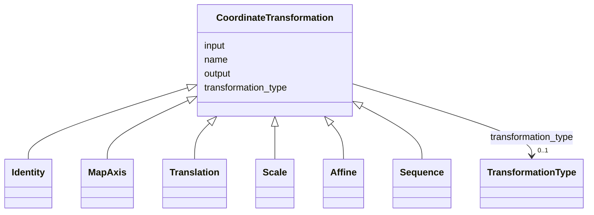

# Class: CoordinateTransformation


_A coordinate transformation_


URI: [https://w3id.org/cetmd/entities/:CoordinateTransformation](https://w3id.org/cetmd/entities/:CoordinateTransformation)





## Inheritance
* **CoordinateTransformation**
    * [Identity](Identity.md)
    * [MapAxis](MapAxis.md)
    * [Translation](Translation.md)
    * [Scale](Scale.md)
    * [Affine](Affine.md)
    * [Sequence](Sequence.md)


## Slots

| Name | Cardinality and Range | Description | Inheritance |
| ---  | --- | --- | --- |
| [transformation_type](transformation_type.md) | 0..1 <br/> [TransformationType](TransformationType.md) | The type of transformation | direct |
| [name](name.md) | 0..1 <br/> [String](String.md) | The name of the coordinate transformation | direct |
| [input](input.md) | 0..1 <br/> [String](String.md) | The source coordinate system name | direct |
| [output](output.md) | 0..1 <br/> [String](String.md) | The target coordinate system name | direct |


## Usages

| used by | used in | type | used |
| ---  | --- | --- | --- |
| [Image2D](Image2D.md) | [coordinate_transformations](coordinate_transformations.md) | range | [CoordinateTransformation](CoordinateTransformation.md) |
| [Image3D](Image3D.md) | [coordinate_transformations](coordinate_transformations.md) | range | [CoordinateTransformation](CoordinateTransformation.md) |
| [Sequence](Sequence.md) | [sequence](sequence.md) | range | [CoordinateTransformation](CoordinateTransformation.md) |
| [GainFile](GainFile.md) | [coordinate_transformations](coordinate_transformations.md) | range | [CoordinateTransformation](CoordinateTransformation.md) |
| [DefectFile](DefectFile.md) | [coordinate_transformations](coordinate_transformations.md) | range | [CoordinateTransformation](CoordinateTransformation.md) |
| [MovieFrame](MovieFrame.md) | [coordinate_transformations](coordinate_transformations.md) | range | [CoordinateTransformation](CoordinateTransformation.md) |
| [ProjectionImage](ProjectionImage.md) | [coordinate_transformations](coordinate_transformations.md) | range | [CoordinateTransformation](CoordinateTransformation.md) |
| [SubProjectionImage](SubProjectionImage.md) | [coordinate_transformations](coordinate_transformations.md) | range | [CoordinateTransformation](CoordinateTransformation.md) |
| [Tomogram](Tomogram.md) | [coordinate_transformations](coordinate_transformations.md) | range | [CoordinateTransformation](CoordinateTransformation.md) |
| [ParticleMap](ParticleMap.md) | [coordinate_transformations](coordinate_transformations.md) | range | [CoordinateTransformation](CoordinateTransformation.md) |
| [CoordMetaMixin](CoordMetaMixin.md) | [coordinate_transformations](coordinate_transformations.md) | range | [CoordinateTransformation](CoordinateTransformation.md) |
| [SegmentationMask2D](SegmentationMask2D.md) | [coordinate_transformations](coordinate_transformations.md) | range | [CoordinateTransformation](CoordinateTransformation.md) |
| [SegmentationMask3D](SegmentationMask3D.md) | [coordinate_transformations](coordinate_transformations.md) | range | [CoordinateTransformation](CoordinateTransformation.md) |
| [ProbabilityMap2D](ProbabilityMap2D.md) | [coordinate_transformations](coordinate_transformations.md) | range | [CoordinateTransformation](CoordinateTransformation.md) |
| [ProbabilityMap3D](ProbabilityMap3D.md) | [coordinate_transformations](coordinate_transformations.md) | range | [CoordinateTransformation](CoordinateTransformation.md) |
| [PointSet2D](PointSet2D.md) | [coordinate_transformations](coordinate_transformations.md) | range | [CoordinateTransformation](CoordinateTransformation.md) |
| [PointSet3D](PointSet3D.md) | [coordinate_transformations](coordinate_transformations.md) | range | [CoordinateTransformation](CoordinateTransformation.md) |
| [PointVectorSet2D](PointVectorSet2D.md) | [coordinate_transformations](coordinate_transformations.md) | range | [CoordinateTransformation](CoordinateTransformation.md) |
| [PointVectorSet3D](PointVectorSet3D.md) | [coordinate_transformations](coordinate_transformations.md) | range | [CoordinateTransformation](CoordinateTransformation.md) |
| [PointMatrixSet2D](PointMatrixSet2D.md) | [coordinate_transformations](coordinate_transformations.md) | range | [CoordinateTransformation](CoordinateTransformation.md) |
| [PointMatrixSet3D](PointMatrixSet3D.md) | [coordinate_transformations](coordinate_transformations.md) | range | [CoordinateTransformation](CoordinateTransformation.md) |
| [TriMesh](TriMesh.md) | [coordinate_transformations](coordinate_transformations.md) | range | [CoordinateTransformation](CoordinateTransformation.md) |
| [ProjectionAlignment](ProjectionAlignment.md) | [sequence](sequence.md) | range | [CoordinateTransformation](CoordinateTransformation.md) |


## Identifier and Mapping Information


### Schema Source


* from schema: https://w3id.org/cetmd/entities


## Mappings

| Mapping Type | Mapped Value |
| ---  | ---  |
| self | https://w3id.org/cetmd/entities/:CoordinateTransformation |
| native | https://w3id.org/cetmd/entities/:CoordinateTransformation |


## LinkML Source

<!-- TODO: investigate https://stackoverflow.com/questions/37606292/how-to-create-tabbed-code-blocks-in-mkdocs-or-sphinx -->

### Direct

<details>
```yaml
name: CoordinateTransformation
description: A coordinate transformation
from_schema: https://w3id.org/cetmd/entities
slots:
- transformation_type
attributes:
  name:
    name: name
    description: The name of the coordinate transformation
    from_schema: https://w3id.org/cetmd/coord_transforms
    domain_of:
    - Average
    - Dataset
    - CoordinateSystem
    - CoordinateTransformation
    range: string
  input:
    name: input
    description: The source coordinate system name
    from_schema: https://w3id.org/cetmd/coord_transforms
    rank: 1000
    domain_of:
    - CoordinateTransformation
    - ProjectionAlignment
    range: string
  output:
    name: output
    description: The target coordinate system name
    from_schema: https://w3id.org/cetmd/coord_transforms
    rank: 1000
    domain_of:
    - CoordinateTransformation
    - ProjectionAlignment
    range: string

```
</details>

### Induced

<details>
```yaml
name: CoordinateTransformation
description: A coordinate transformation
from_schema: https://w3id.org/cetmd/entities
attributes:
  name:
    name: name
    description: The name of the coordinate transformation
    from_schema: https://w3id.org/cetmd/coord_transforms
    alias: name
    owner: CoordinateTransformation
    domain_of:
    - Average
    - Dataset
    - CoordinateSystem
    - CoordinateTransformation
    range: string
  input:
    name: input
    description: The source coordinate system name
    from_schema: https://w3id.org/cetmd/coord_transforms
    rank: 1000
    alias: input
    owner: CoordinateTransformation
    domain_of:
    - CoordinateTransformation
    - ProjectionAlignment
    range: string
  output:
    name: output
    description: The target coordinate system name
    from_schema: https://w3id.org/cetmd/coord_transforms
    rank: 1000
    alias: output
    owner: CoordinateTransformation
    domain_of:
    - CoordinateTransformation
    - ProjectionAlignment
    range: string
  transformation_type:
    name: transformation_type
    description: The type of transformation
    from_schema: https://w3id.org/cetmd/entities
    rank: 1000
    alias: transformation_type
    owner: CoordinateTransformation
    domain_of:
    - CoordinateTransformation
    - Identity
    - MapAxis
    - Translation
    - Scale
    - Affine
    - Sequence
    range: TransformationType

```
</details>