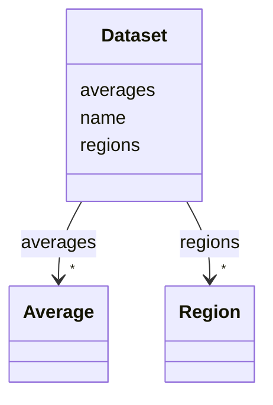

# Class: Dataset


_A dataset_


URI: [https://w3id.org/cetmd/entities/:Dataset](https://w3id.org/cetmd/entities/:Dataset)





<!-- no inheritance hierarchy -->


## Slots

| Name | Cardinality and Range | Description | Inheritance |
| ---  | --- | --- | --- |
| [name](name.md) | 0..1 <br/> [String](String.md) | The name of a given entry | direct |
| [regions](regions.md) | * <br/> [Region](Region.md) | The regions in the dataset | direct |
| [averages](averages.md) | * <br/> [Average](Average.md) | The averages in the dataset | direct |


## Identifier and Mapping Information


### Schema Source


* from schema: https://w3id.org/cetmd/entities


## Mappings

| Mapping Type | Mapped Value |
| ---  | ---  |
| self | https://w3id.org/cetmd/entities/:Dataset |
| native | https://w3id.org/cetmd/entities/:Dataset |


## LinkML Source

<!-- TODO: investigate https://stackoverflow.com/questions/37606292/how-to-create-tabbed-code-blocks-in-mkdocs-or-sphinx -->

### Direct

<details>
```yaml
name: Dataset
description: A dataset
from_schema: https://w3id.org/cetmd/entities
slots:
- name
attributes:
  regions:
    name: regions
    description: The regions in the dataset
    from_schema: https://w3id.org/cetmd/entities
    rank: 1000
    domain_of:
    - Dataset
    range: Region
    multivalued: true
  averages:
    name: averages
    description: The averages in the dataset
    from_schema: https://w3id.org/cetmd/entities
    rank: 1000
    domain_of:
    - Dataset
    range: Average
    multivalued: true

```
</details>

### Induced

<details>
```yaml
name: Dataset
description: A dataset
from_schema: https://w3id.org/cetmd/entities
attributes:
  regions:
    name: regions
    description: The regions in the dataset
    from_schema: https://w3id.org/cetmd/entities
    rank: 1000
    alias: regions
    owner: Dataset
    domain_of:
    - Dataset
    range: Region
    multivalued: true
  averages:
    name: averages
    description: The averages in the dataset
    from_schema: https://w3id.org/cetmd/entities
    rank: 1000
    alias: averages
    owner: Dataset
    domain_of:
    - Dataset
    range: Average
    multivalued: true
  name:
    name: name
    description: The name of a given entry
    from_schema: https://w3id.org/cetmd/entities
    rank: 1000
    alias: name
    owner: Dataset
    domain_of:
    - Average
    - Dataset
    - CoordinateSystem
    - CoordinateTransformation
    range: string

```
</details>