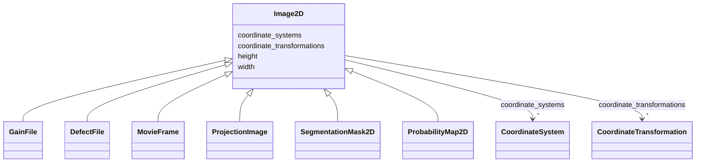

# Class: Image2D


_A 2D image._


URI: [https://w3id.org/cetmd/entities/:Image2D](https://w3id.org/cetmd/entities/:Image2D)





## Inheritance
* **Image2D**
    * [GainFile](GainFile.md)
    * [DefectFile](DefectFile.md)
    * [MovieFrame](MovieFrame.md) [ [AcquisitionMetadataMixin](AcquisitionMetadataMixin.md)]
    * [ProjectionImage](ProjectionImage.md) [ [AcquisitionMetadataMixin](AcquisitionMetadataMixin.md)]


## Slots

| Name | Cardinality and Range | Description | Inheritance |
| ---  | --- | --- | --- |
| [width](width.md) | 0..1 <br/> [Integer](Integer.md) | The width of the image (x-axis) in pixels | direct |
| [height](height.md) | 0..1 <br/> [Integer](Integer.md) | The height of the image (y-axis) in pixels | direct |
| [coordinate_systems](coordinate_systems.md) | * <br/> [CoordinateSystem](CoordinateSystem.md) | Named coordinate systems for this entity | direct |
| [coordinate_transformations](coordinate_transformations.md) | * <br/> [CoordinateTransformation](CoordinateTransformation.md) | Named coordinate systems for this entity | direct |


## Usages

| used by | used in | type | used |
| ---  | --- | --- | --- |
| [ImageStack2D](ImageStack2D.md) | [images2D](images2D.md) | range | [Image2D](Image2D.md) |


## Identifier and Mapping Information


### Schema Source


* from schema: https://w3id.org/cetmd/entities


## Mappings

| Mapping Type | Mapped Value |
| ---  | ---  |
| self | https://w3id.org/cetmd/entities/:Image2D |
| native | https://w3id.org/cetmd/entities/:Image2D |


## LinkML Source

<!-- TODO: investigate https://stackoverflow.com/questions/37606292/how-to-create-tabbed-code-blocks-in-mkdocs-or-sphinx -->

### Direct

<details>
```yaml
name: Image2D
description: A 2D image.
from_schema: https://w3id.org/cetmd/entities
slots:
- width
- height
- coordinate_systems
- coordinate_transformations

```
</details>

### Induced

<details>
```yaml
name: Image2D
description: A 2D image.
from_schema: https://w3id.org/cetmd/entities
attributes:
  width:
    name: width
    description: The width of the image (x-axis) in pixels
    from_schema: https://w3id.org/cetmd/entities
    rank: 1000
    alias: width
    owner: Image2D
    domain_of:
    - Image2D
    - Image3D
    range: integer
  height:
    name: height
    description: The height of the image (y-axis) in pixels
    from_schema: https://w3id.org/cetmd/entities
    rank: 1000
    alias: height
    owner: Image2D
    domain_of:
    - Image2D
    - Image3D
    range: integer
  coordinate_systems:
    name: coordinate_systems
    description: Named coordinate systems for this entity
    from_schema: https://w3id.org/cetmd/entities
    rank: 1000
    alias: coordinate_systems
    owner: Image2D
    domain_of:
    - Image2D
    - Image3D
    - CoordMetaMixin
    range: CoordinateSystem
    multivalued: true
  coordinate_transformations:
    name: coordinate_transformations
    description: Named coordinate systems for this entity
    from_schema: https://w3id.org/cetmd/entities
    rank: 1000
    alias: coordinate_transformations
    owner: Image2D
    domain_of:
    - Image2D
    - Image3D
    - CoordMetaMixin
    range: CoordinateTransformation
    multivalued: true

```
</details>