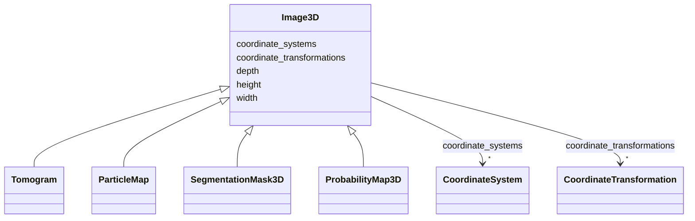

# Class: Image3D


_A 3D image._


URI: [https://w3id.org/cetmd/entities/:Image3D](https://w3id.org/cetmd/entities/:Image3D)





## Inheritance
* **Image3D**
    * [Tomogram](Tomogram.md)
    * [ParticleMap](ParticleMap.md)


## Slots

| Name | Cardinality and Range | Description | Inheritance |
| ---  | --- | --- | --- |
| [width](width.md) | 0..1 <br/> [Integer](Integer.md) | The width of the image (x-axis) in pixels | direct |
| [height](height.md) | 0..1 <br/> [Integer](Integer.md) | The height of the image (y-axis) in pixels | direct |
| [depth](depth.md) | 0..1 <br/> [Integer](Integer.md) | The depth of the image (z-axis) in pixels | direct |
| [coordinate_systems](coordinate_systems.md) | * <br/> [CoordinateSystem](CoordinateSystem.md) | Named coordinate systems for this entity | direct |
| [coordinate_transformations](coordinate_transformations.md) | * <br/> [CoordinateTransformation](CoordinateTransformation.md) | Named coordinate systems for this entity | direct |


## Usages

| used by | used in | type | used |
| ---  | --- | --- | --- |
| [ImageStack3D](ImageStack3D.md) | [images3D](images3D.md) | range | [Image3D](Image3D.md) |


## Identifier and Mapping Information


### Schema Source


* from schema: https://w3id.org/cetmd/entities


## Mappings

| Mapping Type | Mapped Value |
| ---  | ---  |
| self | https://w3id.org/cetmd/entities/:Image3D |
| native | https://w3id.org/cetmd/entities/:Image3D |


## LinkML Source

<!-- TODO: investigate https://stackoverflow.com/questions/37606292/how-to-create-tabbed-code-blocks-in-mkdocs-or-sphinx -->

### Direct

<details>
```yaml
name: Image3D
description: A 3D image.
from_schema: https://w3id.org/cetmd/entities
slots:
- width
- height
- depth
- coordinate_systems
- coordinate_transformations

```
</details>

### Induced

<details>
```yaml
name: Image3D
description: A 3D image.
from_schema: https://w3id.org/cetmd/entities
attributes:
  width:
    name: width
    description: The width of the image (x-axis) in pixels
    from_schema: https://w3id.org/cetmd/entities
    rank: 1000
    alias: width
    owner: Image3D
    domain_of:
    - Image2D
    - Image3D
    range: integer
  height:
    name: height
    description: The height of the image (y-axis) in pixels
    from_schema: https://w3id.org/cetmd/entities
    rank: 1000
    alias: height
    owner: Image3D
    domain_of:
    - Image2D
    - Image3D
    range: integer
  depth:
    name: depth
    description: The depth of the image (z-axis) in pixels
    from_schema: https://w3id.org/cetmd/entities
    rank: 1000
    alias: depth
    owner: Image3D
    domain_of:
    - Image3D
    range: integer
  coordinate_systems:
    name: coordinate_systems
    description: Named coordinate systems for this entity
    from_schema: https://w3id.org/cetmd/entities
    rank: 1000
    alias: coordinate_systems
    owner: Image3D
    domain_of:
    - Image2D
    - Image3D
    - CoordMetaMixin
    range: CoordinateSystem
    multivalued: true
  coordinate_transformations:
    name: coordinate_transformations
    description: Named coordinate systems for this entity
    from_schema: https://w3id.org/cetmd/entities
    rank: 1000
    alias: coordinate_transformations
    owner: Image3D
    domain_of:
    - Image2D
    - Image3D
    - CoordMetaMixin
    range: CoordinateTransformation
    multivalued: true

```
</details>