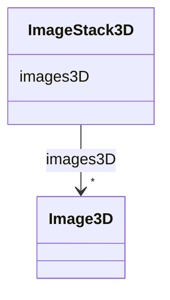

# Class: ImageStack3D


_A stack of 3D images._


URI: [https://w3id.org/cetmd/entities/:ImageStack3D](https://w3id.org/cetmd/entities/:ImageStack3D)





<!-- no inheritance hierarchy -->


## Slots

| Name | Cardinality and Range | Description | Inheritance |
| ---  | --- | --- | --- |
| [images3D](images3D.md) | * <br/> [Image3D](Image3D.md) | The images in the stack | direct |


## Identifier and Mapping Information


### Schema Source


* from schema: https://w3id.org/cetmd/entities


## Mappings

| Mapping Type | Mapped Value |
| ---  | ---  |
| self | https://w3id.org/cetmd/entities/:ImageStack3D |
| native | https://w3id.org/cetmd/entities/:ImageStack3D |


## LinkML Source

<!-- TODO: investigate https://stackoverflow.com/questions/37606292/how-to-create-tabbed-code-blocks-in-mkdocs-or-sphinx -->

### Direct

<details>
```yaml
name: ImageStack3D
description: A stack of 3D images.
from_schema: https://w3id.org/cetmd/entities
slots:
- images3D

```
</details>

### Induced

<details>
```yaml
name: ImageStack3D
description: A stack of 3D images.
from_schema: https://w3id.org/cetmd/entities
attributes:
  images3D:
    name: images3D
    description: The images in the stack
    from_schema: https://w3id.org/cetmd/entities
    rank: 1000
    alias: images3D
    owner: ImageStack3D
    domain_of:
    - ImageStack3D
    range: Image3D
    multivalued: true

```
</details>