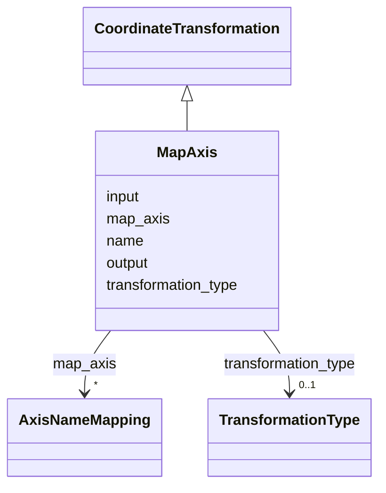

# Class: MapAxis


_Axis permutation transformation_


URI: [https://w3id.org/cetmd/entities/:MapAxis](https://w3id.org/cetmd/entities/:MapAxis)





## Inheritance
* [CoordinateTransformation](CoordinateTransformation.md)
    * **MapAxis**


## Slots

| Name | Cardinality and Range | Description | Inheritance |
| ---  | --- | --- | --- |
| [transformation_type](transformation_type.md) | 0..1 <br/> [TransformationType](TransformationType.md) | The type of transformation | direct |
| [map_axis](map_axis.md) | * <br/> [AxisNameMapping](AxisNameMapping.md) | The permutation of the axes | direct |
| [name](name.md) | 0..1 <br/> [String](String.md) | The name of the coordinate transformation | [CoordinateTransformation](CoordinateTransformation.md) |
| [input](input.md) | 0..1 <br/> [String](String.md) | The source coordinate system name | [CoordinateTransformation](CoordinateTransformation.md) |
| [output](output.md) | 0..1 <br/> [String](String.md) | The target coordinate system name | [CoordinateTransformation](CoordinateTransformation.md) |


## Identifier and Mapping Information


### Schema Source


* from schema: https://w3id.org/cetmd/entities


## Mappings

| Mapping Type | Mapped Value |
| ---  | ---  |
| self | https://w3id.org/cetmd/entities/:MapAxis |
| native | https://w3id.org/cetmd/entities/:MapAxis |


## LinkML Source

<!-- TODO: investigate https://stackoverflow.com/questions/37606292/how-to-create-tabbed-code-blocks-in-mkdocs-or-sphinx -->

### Direct

<details>
```yaml
name: MapAxis
description: Axis permutation transformation
from_schema: https://w3id.org/cetmd/entities
is_a: CoordinateTransformation
slots:
- transformation_type
slot_usage:
  transformation_type:
    name: transformation_type
    ifabsent: map_axis
attributes:
  map_axis:
    name: map_axis
    description: The permutation of the axes
    from_schema: https://w3id.org/cetmd/coord_transforms
    rank: 1000
    domain_of:
    - MapAxis
    range: AxisNameMapping
    multivalued: true
    inlined: true

```
</details>

### Induced

<details>
```yaml
name: MapAxis
description: Axis permutation transformation
from_schema: https://w3id.org/cetmd/entities
is_a: CoordinateTransformation
slot_usage:
  transformation_type:
    name: transformation_type
    ifabsent: map_axis
attributes:
  map_axis:
    name: map_axis
    description: The permutation of the axes
    from_schema: https://w3id.org/cetmd/coord_transforms
    rank: 1000
    alias: map_axis
    owner: MapAxis
    domain_of:
    - MapAxis
    range: AxisNameMapping
    multivalued: true
    inlined: true
  transformation_type:
    name: transformation_type
    description: The type of transformation
    from_schema: https://w3id.org/cetmd/entities
    rank: 1000
    ifabsent: map_axis
    alias: transformation_type
    owner: MapAxis
    domain_of:
    - CoordinateTransformation
    - Identity
    - MapAxis
    - Translation
    - Scale
    - Affine
    - Sequence
    range: TransformationType
  name:
    name: name
    description: The name of the coordinate transformation
    from_schema: https://w3id.org/cetmd/coord_transforms
    alias: name
    owner: MapAxis
    domain_of:
    - Average
    - Dataset
    - CoordinateSystem
    - CoordinateTransformation
    range: string
  input:
    name: input
    description: The source coordinate system name
    from_schema: https://w3id.org/cetmd/coord_transforms
    rank: 1000
    alias: input
    owner: MapAxis
    domain_of:
    - CoordinateTransformation
    - ProjectionAlignment
    range: string
  output:
    name: output
    description: The target coordinate system name
    from_schema: https://w3id.org/cetmd/coord_transforms
    rank: 1000
    alias: output
    owner: MapAxis
    domain_of:
    - CoordinateTransformation
    - ProjectionAlignment
    range: string

```
</details>