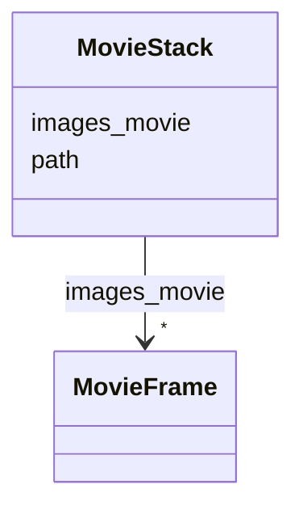

# Class: MovieStack


_A stack of movie frames._


URI: [https://w3id.org/cetmd/entities/:MovieStack](https://w3id.org/cetmd/entities/:MovieStack)





<!-- no inheritance hierarchy -->


## Slots

| Name | Cardinality and Range | Description | Inheritance |
| ---  | --- | --- | --- |
| [path](path.md) | 0..1 <br/> [String](String.md) | Path to a file | direct |
| [images_movie](images_movie.md) | * <br/> [MovieFrame](MovieFrame.md) | The movie frames in the stack | direct |


## Usages

| used by | used in | type | used |
| ---  | --- | --- | --- |
| [MovieStackSeries](MovieStackSeries.md) | [stacks](stacks.md) | range | [MovieStack](MovieStack.md) |


## Identifier and Mapping Information


### Schema Source


* from schema: https://w3id.org/cetmd/entities


## Mappings

| Mapping Type | Mapped Value |
| ---  | ---  |
| self | https://w3id.org/cetmd/entities/:MovieStack |
| native | https://w3id.org/cetmd/entities/:MovieStack |


## LinkML Source

<!-- TODO: investigate https://stackoverflow.com/questions/37606292/how-to-create-tabbed-code-blocks-in-mkdocs-or-sphinx -->

### Direct

<details>
```yaml
name: MovieStack
description: A stack of movie frames.
from_schema: https://w3id.org/cetmd/entities
slots:
- path
- images_movie

```
</details>

### Induced

<details>
```yaml
name: MovieStack
description: A stack of movie frames.
from_schema: https://w3id.org/cetmd/entities
attributes:
  path:
    name: path
    description: Path to a file.
    from_schema: https://w3id.org/cetmd/entities
    rank: 1000
    alias: path
    owner: MovieStack
    domain_of:
    - GainFile
    - DefectFile
    - MovieFrame
    - MovieStack
    - ProjectionImage
    - TiltSeries
    - Tomogram
    - ParticleMap
    - Annotation
    range: string
  images_movie:
    name: images_movie
    description: The movie frames in the stack
    from_schema: https://w3id.org/cetmd/entities
    rank: 1000
    alias: images_movie
    owner: MovieStack
    domain_of:
    - MovieStack
    range: MovieFrame
    multivalued: true

```
</details>