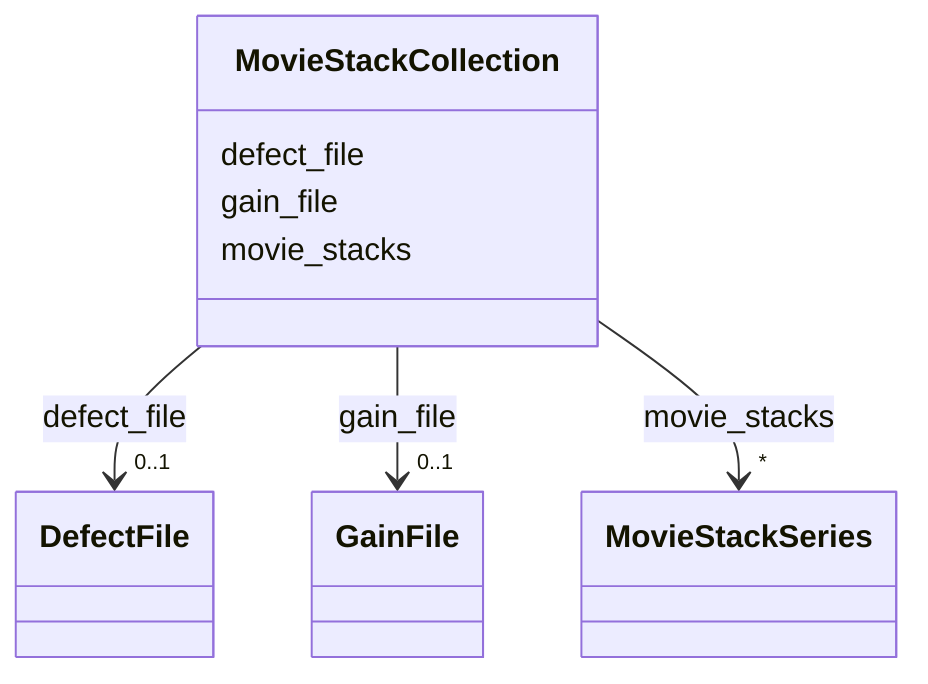

# Class: MovieStackCollection


_A collection of movie stacks using the same gain and defect files._


URI: [https://w3id.org/cetmd/entities/:MovieStackCollection](https://w3id.org/cetmd/entities/:MovieStackCollection)





<!-- no inheritance hierarchy -->


## Slots

| Name | Cardinality and Range | Description | Inheritance |
| ---  | --- | --- | --- |
| [movie_stacks](movie_stacks.md) | * <br/> [MovieStackSeries](MovieStackSeries.md) | The movie stacks in the collection | direct |
| [gain_file](gain_file.md) | 0..1 <br/> [GainFile](GainFile.md) | The gain file for the movie stacks | direct |
| [defect_file](defect_file.md) | 0..1 <br/> [DefectFile](DefectFile.md) | The defect file for the movie stacks | direct |


## Usages

| used by | used in | type | used |
| ---  | --- | --- | --- |
| [Region](Region.md) | [movie_stack_collections](movie_stack_collections.md) | range | [MovieStackCollection](MovieStackCollection.md) |


## Identifier and Mapping Information


### Schema Source


* from schema: https://w3id.org/cetmd/entities


## Mappings

| Mapping Type | Mapped Value |
| ---  | ---  |
| self | https://w3id.org/cetmd/entities/:MovieStackCollection |
| native | https://w3id.org/cetmd/entities/:MovieStackCollection |


## LinkML Source

<!-- TODO: investigate https://stackoverflow.com/questions/37606292/how-to-create-tabbed-code-blocks-in-mkdocs-or-sphinx -->

### Direct

<details>
```yaml
name: MovieStackCollection
description: A collection of movie stacks using the same gain and defect files.
from_schema: https://w3id.org/cetmd/entities
attributes:
  movie_stacks:
    name: movie_stacks
    description: The movie stacks in the collection
    from_schema: https://w3id.org/cetmd/entities
    rank: 1000
    domain_of:
    - MovieStackCollection
    range: MovieStackSeries
    multivalued: true
  gain_file:
    name: gain_file
    description: The gain file for the movie stacks
    from_schema: https://w3id.org/cetmd/entities
    rank: 1000
    domain_of:
    - MovieStackCollection
    range: GainFile
  defect_file:
    name: defect_file
    description: The defect file for the movie stacks
    from_schema: https://w3id.org/cetmd/entities
    rank: 1000
    domain_of:
    - MovieStackCollection
    range: DefectFile

```
</details>

### Induced

<details>
```yaml
name: MovieStackCollection
description: A collection of movie stacks using the same gain and defect files.
from_schema: https://w3id.org/cetmd/entities
attributes:
  movie_stacks:
    name: movie_stacks
    description: The movie stacks in the collection
    from_schema: https://w3id.org/cetmd/entities
    rank: 1000
    alias: movie_stacks
    owner: MovieStackCollection
    domain_of:
    - MovieStackCollection
    range: MovieStackSeries
    multivalued: true
  gain_file:
    name: gain_file
    description: The gain file for the movie stacks
    from_schema: https://w3id.org/cetmd/entities
    rank: 1000
    alias: gain_file
    owner: MovieStackCollection
    domain_of:
    - MovieStackCollection
    range: GainFile
  defect_file:
    name: defect_file
    description: The defect file for the movie stacks
    from_schema: https://w3id.org/cetmd/entities
    rank: 1000
    alias: defect_file
    owner: MovieStackCollection
    domain_of:
    - MovieStackCollection
    range: DefectFile

```
</details>