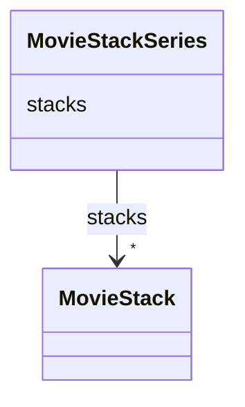

# Class: MovieStackSeries


_A group of movie stacks that belong to a single tilt series._


URI: [https://w3id.org/cetmd/entities/:MovieStackSeries](https://w3id.org/cetmd/entities/:MovieStackSeries)





<!-- no inheritance hierarchy -->


## Slots

| Name | Cardinality and Range | Description | Inheritance |
| ---  | --- | --- | --- |
| [stacks](stacks.md) | * <br/> [MovieStack](MovieStack.md) | The movie stacks | direct |


## Usages

| used by | used in | type | used |
| ---  | --- | --- | --- |
| [MovieStackCollection](MovieStackCollection.md) | [movie_stacks](movie_stacks.md) | range | [MovieStackSeries](MovieStackSeries.md) |


## Identifier and Mapping Information


### Schema Source


* from schema: https://w3id.org/cetmd/entities


## Mappings

| Mapping Type | Mapped Value |
| ---  | ---  |
| self | https://w3id.org/cetmd/entities/:MovieStackSeries |
| native | https://w3id.org/cetmd/entities/:MovieStackSeries |


## LinkML Source

<!-- TODO: investigate https://stackoverflow.com/questions/37606292/how-to-create-tabbed-code-blocks-in-mkdocs-or-sphinx -->

### Direct

<details>
```yaml
name: MovieStackSeries
description: A group of movie stacks that belong to a single tilt series.
from_schema: https://w3id.org/cetmd/entities
attributes:
  stacks:
    name: stacks
    description: The movie stacks.
    from_schema: https://w3id.org/cetmd/image_entities
    rank: 1000
    domain_of:
    - MovieStackSeries
    range: MovieStack
    multivalued: true

```
</details>

### Induced

<details>
```yaml
name: MovieStackSeries
description: A group of movie stacks that belong to a single tilt series.
from_schema: https://w3id.org/cetmd/entities
attributes:
  stacks:
    name: stacks
    description: The movie stacks.
    from_schema: https://w3id.org/cetmd/image_entities
    rank: 1000
    alias: stacks
    owner: MovieStackSeries
    domain_of:
    - MovieStackSeries
    range: MovieStack
    multivalued: true

```
</details>