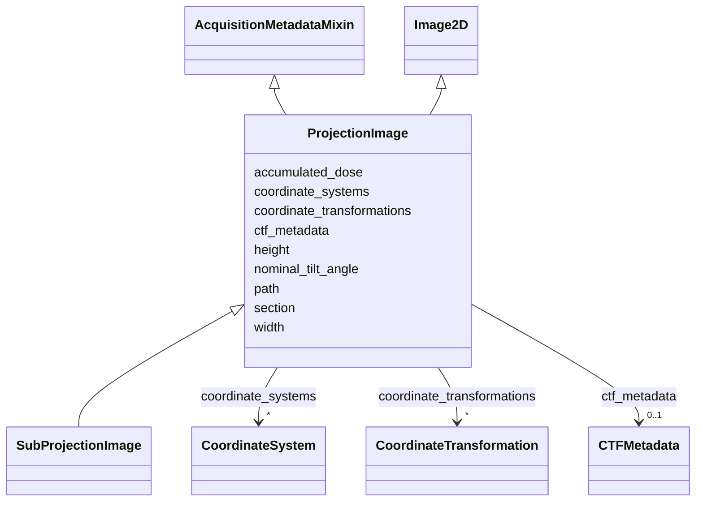

# Class: ProjectionImage


_A projection image._


URI: [https://w3id.org/cetmd/entities/:ProjectionImage](https://w3id.org/cetmd/entities/:ProjectionImage)





## Inheritance
* [Image2D](Image2D.md)
    * **ProjectionImage** [ [AcquisitionMetadataMixin](AcquisitionMetadataMixin.md)]
        * [SubProjectionImage](SubProjectionImage.md)


## Slots

| Name | Cardinality and Range | Description | Inheritance |
| ---  | --- | --- | --- |
| [path](path.md) | 0..1 <br/> [String](String.md) | Path to a file | direct |
| [section](section.md) | 0..1 <br/> [Integer](Integer.md) | 0-based section index to the entity inside a stack | direct |
| [nominal_tilt_angle](nominal_tilt_angle.md) | 0..1 <br/> [Float](Float.md) | The tilt angle reported by the microscope | [AcquisitionMetadataMixin](AcquisitionMetadataMixin.md) |
| [accumulated_dose](accumulated_dose.md) | 0..1 <br/> [Float](Float.md) | The pre-exposure up to this image in e-/A^2 | [AcquisitionMetadataMixin](AcquisitionMetadataMixin.md) |
| [ctf_metadata](ctf_metadata.md) | 0..1 <br/> [CTFMetadata](CTFMetadata.md) | A set of CTF patameters for an image | [AcquisitionMetadataMixin](AcquisitionMetadataMixin.md) |
| [width](width.md) | 0..1 <br/> [Integer](Integer.md) | The width of the image (x-axis) in pixels | [Image2D](Image2D.md) |
| [height](height.md) | 0..1 <br/> [Integer](Integer.md) | The height of the image (y-axis) in pixels | [Image2D](Image2D.md) |
| [coordinate_systems](coordinate_systems.md) | * <br/> [CoordinateSystem](CoordinateSystem.md) | Named coordinate systems for this entity | [Image2D](Image2D.md) |
| [coordinate_transformations](coordinate_transformations.md) | * <br/> [CoordinateTransformation](CoordinateTransformation.md) | Named coordinate systems for this entity | [Image2D](Image2D.md) |


## Usages

| used by | used in | type | used |
| ---  | --- | --- | --- |
| [TiltSeries](TiltSeries.md) | [images_tilt](images_tilt.md) | range | [ProjectionImage](ProjectionImage.md) |


## Identifier and Mapping Information


### Schema Source


* from schema: https://w3id.org/cetmd/entities


## Mappings

| Mapping Type | Mapped Value |
| ---  | ---  |
| self | https://w3id.org/cetmd/entities/:ProjectionImage |
| native | https://w3id.org/cetmd/entities/:ProjectionImage |


## LinkML Source

<!-- TODO: investigate https://stackoverflow.com/questions/37606292/how-to-create-tabbed-code-blocks-in-mkdocs-or-sphinx -->

### Direct

<details>
```yaml
name: ProjectionImage
description: A projection image.
from_schema: https://w3id.org/cetmd/entities
is_a: Image2D
mixins:
- AcquisitionMetadataMixin
slots:
- path
- section

```
</details>

### Induced

<details>
```yaml
name: ProjectionImage
description: A projection image.
from_schema: https://w3id.org/cetmd/entities
is_a: Image2D
mixins:
- AcquisitionMetadataMixin
attributes:
  path:
    name: path
    description: Path to a file.
    from_schema: https://w3id.org/cetmd/entities
    rank: 1000
    alias: path
    owner: ProjectionImage
    domain_of:
    - GainFile
    - DefectFile
    - MovieFrame
    - MovieStack
    - ProjectionImage
    - TiltSeries
    - Tomogram
    - ParticleMap
    - Annotation
    range: string
  section:
    name: section
    description: 0-based section index to the entity inside a stack.
    from_schema: https://w3id.org/cetmd/entities
    rank: 1000
    alias: section
    owner: ProjectionImage
    domain_of:
    - MovieFrame
    - ProjectionImage
    range: integer
  nominal_tilt_angle:
    name: nominal_tilt_angle
    description: The tilt angle reported by the microscope
    from_schema: https://w3id.org/cetmd/entities
    rank: 1000
    alias: nominal_tilt_angle
    owner: ProjectionImage
    domain_of:
    - AcquisitionMetadataMixin
    range: float
  accumulated_dose:
    name: accumulated_dose
    description: The pre-exposure up to this image in e-/A^2
    from_schema: https://w3id.org/cetmd/entities
    rank: 1000
    alias: accumulated_dose
    owner: ProjectionImage
    domain_of:
    - AcquisitionMetadataMixin
    range: float
  ctf_metadata:
    name: ctf_metadata
    description: A set of CTF patameters for an image.
    from_schema: https://w3id.org/cetmd/entities
    rank: 1000
    alias: ctf_metadata
    owner: ProjectionImage
    domain_of:
    - AcquisitionMetadataMixin
    range: CTFMetadata
  width:
    name: width
    description: The width of the image (x-axis) in pixels
    from_schema: https://w3id.org/cetmd/entities
    rank: 1000
    alias: width
    owner: ProjectionImage
    domain_of:
    - Image2D
    - Image3D
    range: integer
  height:
    name: height
    description: The height of the image (y-axis) in pixels
    from_schema: https://w3id.org/cetmd/entities
    rank: 1000
    alias: height
    owner: ProjectionImage
    domain_of:
    - Image2D
    - Image3D
    range: integer
  coordinate_systems:
    name: coordinate_systems
    description: Named coordinate systems for this entity
    from_schema: https://w3id.org/cetmd/entities
    rank: 1000
    alias: coordinate_systems
    owner: ProjectionImage
    domain_of:
    - Image2D
    - Image3D
    - CoordMetaMixin
    range: CoordinateSystem
    multivalued: true
  coordinate_transformations:
    name: coordinate_transformations
    description: Named coordinate systems for this entity
    from_schema: https://w3id.org/cetmd/entities
    rank: 1000
    alias: coordinate_transformations
    owner: ProjectionImage
    domain_of:
    - Image2D
    - Image3D
    - CoordMetaMixin
    range: CoordinateTransformation
    multivalued: true

```
</details>