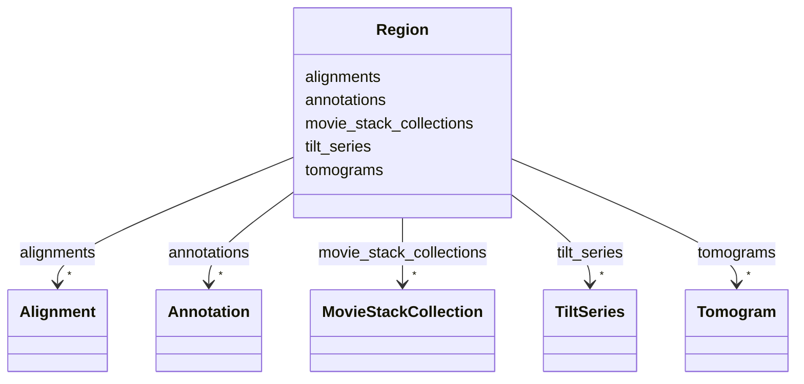

# Class: Region


_Raw data (movie stacks) and derived data (tilt series, tomograms, annotations) from a single region of a specimen._


URI: [https://w3id.org/cetmd/entities/:Region](https://w3id.org/cetmd/entities/:Region)





<!-- no inheritance hierarchy -->


## Slots

| Name | Cardinality and Range | Description | Inheritance |
| ---  | --- | --- | --- |
| [annotations](annotations.md) | * <br/> [Annotation](Annotation.md) | The annotations | direct |
| [movie_stack_collections](movie_stack_collections.md) | * <br/> [MovieStackCollection](MovieStackCollection.md) | The movie stack | direct |
| [tilt_series](tilt_series.md) | * <br/> [TiltSeries](TiltSeries.md) | The tilt series | direct |
| [alignments](alignments.md) | * <br/> [Alignment](Alignment.md) | The alignments | direct |
| [tomograms](tomograms.md) | * <br/> [Tomogram](Tomogram.md) | The tomograms | direct |


## Usages

| used by | used in | type | used |
| ---  | --- | --- | --- |
| [Dataset](Dataset.md) | [regions](regions.md) | range | [Region](Region.md) |


## Identifier and Mapping Information


### Schema Source


* from schema: https://w3id.org/cetmd/entities


## Mappings

| Mapping Type | Mapped Value |
| ---  | ---  |
| self | https://w3id.org/cetmd/entities/:Region |
| native | https://w3id.org/cetmd/entities/:Region |


## LinkML Source

<!-- TODO: investigate https://stackoverflow.com/questions/37606292/how-to-create-tabbed-code-blocks-in-mkdocs-or-sphinx -->

### Direct

<details>
```yaml
name: Region
description: Raw data (movie stacks) and derived data (tilt series, tomograms, annotations)
  from a single region of a specimen.
from_schema: https://w3id.org/cetmd/entities
slots:
- annotations
attributes:
  movie_stack_collections:
    name: movie_stack_collections
    description: The movie stack
    from_schema: https://w3id.org/cetmd/entities
    rank: 1000
    domain_of:
    - Region
    range: MovieStackCollection
    multivalued: true
  tilt_series:
    name: tilt_series
    description: The tilt series
    from_schema: https://w3id.org/cetmd/entities
    rank: 1000
    domain_of:
    - Region
    range: TiltSeries
    multivalued: true
  alignments:
    name: alignments
    description: The alignments
    from_schema: https://w3id.org/cetmd/entities
    rank: 1000
    domain_of:
    - Region
    range: Alignment
    multivalued: true
  tomograms:
    name: tomograms
    description: The tomograms
    from_schema: https://w3id.org/cetmd/entities
    rank: 1000
    domain_of:
    - Region
    range: Tomogram
    multivalued: true

```
</details>

### Induced

<details>
```yaml
name: Region
description: Raw data (movie stacks) and derived data (tilt series, tomograms, annotations)
  from a single region of a specimen.
from_schema: https://w3id.org/cetmd/entities
attributes:
  movie_stack_collections:
    name: movie_stack_collections
    description: The movie stack
    from_schema: https://w3id.org/cetmd/entities
    rank: 1000
    alias: movie_stack_collections
    owner: Region
    domain_of:
    - Region
    range: MovieStackCollection
    multivalued: true
  tilt_series:
    name: tilt_series
    description: The tilt series
    from_schema: https://w3id.org/cetmd/entities
    rank: 1000
    alias: tilt_series
    owner: Region
    domain_of:
    - Region
    range: TiltSeries
    multivalued: true
  alignments:
    name: alignments
    description: The alignments
    from_schema: https://w3id.org/cetmd/entities
    rank: 1000
    alias: alignments
    owner: Region
    domain_of:
    - Region
    range: Alignment
    multivalued: true
  tomograms:
    name: tomograms
    description: The tomograms
    from_schema: https://w3id.org/cetmd/entities
    rank: 1000
    alias: tomograms
    owner: Region
    domain_of:
    - Region
    range: Tomogram
    multivalued: true
  annotations:
    name: annotations
    description: The annotations
    from_schema: https://w3id.org/cetmd/entities
    rank: 1000
    alias: annotations
    owner: Region
    domain_of:
    - Region
    - Average
    range: Annotation
    multivalued: true

```
</details>