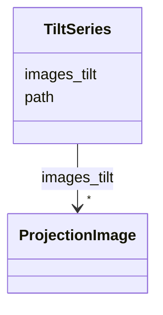

# Class: TiltSeries


_A stack of projection images._


URI: [https://w3id.org/cetmd/entities/:TiltSeries](https://w3id.org/cetmd/entities/:TiltSeries)





<!-- no inheritance hierarchy -->


## Slots

| Name | Cardinality and Range | Description | Inheritance |
| ---  | --- | --- | --- |
| [images_tilt](images_tilt.md) | * <br/> [ProjectionImage](ProjectionImage.md) | The projections in the stack | direct |
| [path](path.md) | 0..1 <br/> [String](String.md) | Path to a file | direct |


## Usages

| used by | used in | type | used |
| ---  | --- | --- | --- |
| [Region](Region.md) | [tilt_series](tilt_series.md) | range | [TiltSeries](TiltSeries.md) |


## Identifier and Mapping Information


### Schema Source


* from schema: https://w3id.org/cetmd/entities


## Mappings

| Mapping Type | Mapped Value |
| ---  | ---  |
| self | https://w3id.org/cetmd/entities/:TiltSeries |
| native | https://w3id.org/cetmd/entities/:TiltSeries |


## LinkML Source

<!-- TODO: investigate https://stackoverflow.com/questions/37606292/how-to-create-tabbed-code-blocks-in-mkdocs-or-sphinx -->

### Direct

<details>
```yaml
name: TiltSeries
description: A stack of projection images.
from_schema: https://w3id.org/cetmd/entities
slots:
- images_tilt
- path

```
</details>

### Induced

<details>
```yaml
name: TiltSeries
description: A stack of projection images.
from_schema: https://w3id.org/cetmd/entities
attributes:
  images_tilt:
    name: images_tilt
    description: The projections in the stack
    from_schema: https://w3id.org/cetmd/entities
    rank: 1000
    alias: images_tilt
    owner: TiltSeries
    domain_of:
    - TiltSeries
    range: ProjectionImage
    multivalued: true
  path:
    name: path
    description: Path to a file.
    from_schema: https://w3id.org/cetmd/entities
    rank: 1000
    alias: path
    owner: TiltSeries
    domain_of:
    - GainFile
    - DefectFile
    - MovieFrame
    - MovieStack
    - ProjectionImage
    - TiltSeries
    - Tomogram
    - ParticleMap
    - Annotation
    range: string

```
</details>