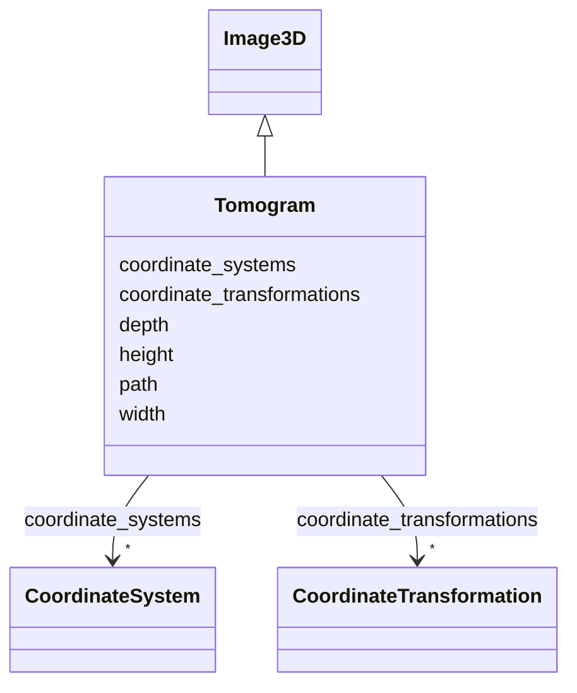

# Class: Tomogram


_A 3D tomogram._


URI: [https://w3id.org/cetmd/entities/:Tomogram](https://w3id.org/cetmd/entities/:Tomogram)





## Inheritance
* [Image3D](Image3D.md)
    * **Tomogram**


## Slots

| Name | Cardinality and Range | Description | Inheritance |
| ---  | --- | --- | --- |
| [path](path.md) | 0..1 <br/> [String](String.md) | Path to a file | direct |
| [width](width.md) | 0..1 <br/> [Integer](Integer.md) | The width of the image (x-axis) in pixels | [Image3D](Image3D.md) |
| [height](height.md) | 0..1 <br/> [Integer](Integer.md) | The height of the image (y-axis) in pixels | [Image3D](Image3D.md) |
| [depth](depth.md) | 0..1 <br/> [Integer](Integer.md) | The depth of the image (z-axis) in pixels | [Image3D](Image3D.md) |
| [coordinate_systems](coordinate_systems.md) | * <br/> [CoordinateSystem](CoordinateSystem.md) | Named coordinate systems for this entity | [Image3D](Image3D.md) |
| [coordinate_transformations](coordinate_transformations.md) | * <br/> [CoordinateTransformation](CoordinateTransformation.md) | Named coordinate systems for this entity | [Image3D](Image3D.md) |


## Usages

| used by | used in | type | used |
| ---  | --- | --- | --- |
| [Region](Region.md) | [tomograms](tomograms.md) | range | [Tomogram](Tomogram.md) |


## Identifier and Mapping Information


### Schema Source


* from schema: https://w3id.org/cetmd/entities


## Mappings

| Mapping Type | Mapped Value |
| ---  | ---  |
| self | https://w3id.org/cetmd/entities/:Tomogram |
| native | https://w3id.org/cetmd/entities/:Tomogram |


## LinkML Source

<!-- TODO: investigate https://stackoverflow.com/questions/37606292/how-to-create-tabbed-code-blocks-in-mkdocs-or-sphinx -->

### Direct

<details>
```yaml
name: Tomogram
description: A 3D tomogram.
from_schema: https://w3id.org/cetmd/entities
is_a: Image3D
slots:
- path

```
</details>

### Induced

<details>
```yaml
name: Tomogram
description: A 3D tomogram.
from_schema: https://w3id.org/cetmd/entities
is_a: Image3D
attributes:
  path:
    name: path
    description: Path to a file.
    from_schema: https://w3id.org/cetmd/entities
    rank: 1000
    alias: path
    owner: Tomogram
    domain_of:
    - GainFile
    - DefectFile
    - MovieFrame
    - MovieStack
    - ProjectionImage
    - TiltSeries
    - Tomogram
    - ParticleMap
    - Annotation
    range: string
  width:
    name: width
    description: The width of the image (x-axis) in pixels
    from_schema: https://w3id.org/cetmd/entities
    rank: 1000
    alias: width
    owner: Tomogram
    domain_of:
    - Image2D
    - Image3D
    range: integer
  height:
    name: height
    description: The height of the image (y-axis) in pixels
    from_schema: https://w3id.org/cetmd/entities
    rank: 1000
    alias: height
    owner: Tomogram
    domain_of:
    - Image2D
    - Image3D
    range: integer
  depth:
    name: depth
    description: The depth of the image (z-axis) in pixels
    from_schema: https://w3id.org/cetmd/entities
    rank: 1000
    alias: depth
    owner: Tomogram
    domain_of:
    - Image3D
    range: integer
  coordinate_systems:
    name: coordinate_systems
    description: Named coordinate systems for this entity
    from_schema: https://w3id.org/cetmd/entities
    rank: 1000
    alias: coordinate_systems
    owner: Tomogram
    domain_of:
    - Image2D
    - Image3D
    - CoordMetaMixin
    range: CoordinateSystem
    multivalued: true
  coordinate_transformations:
    name: coordinate_transformations
    description: Named coordinate systems for this entity
    from_schema: https://w3id.org/cetmd/entities
    rank: 1000
    alias: coordinate_transformations
    owner: Tomogram
    domain_of:
    - Image2D
    - Image3D
    - CoordMetaMixin
    range: CoordinateTransformation
    multivalued: true

```
</details>